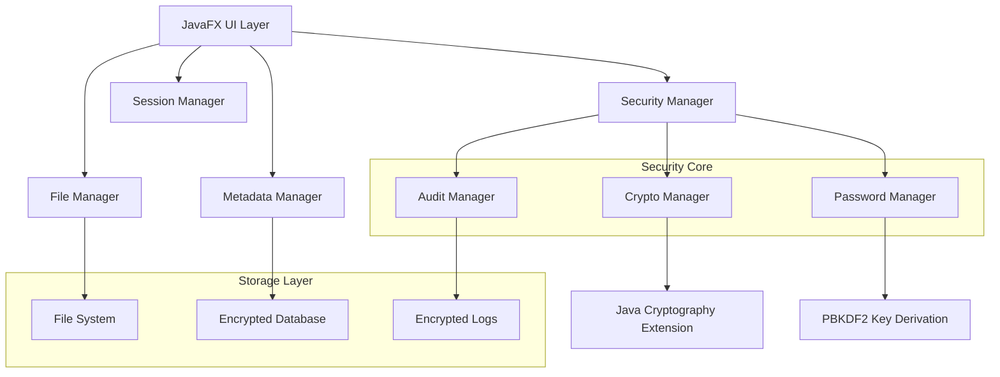

# Design Document

## Overview

GhostVault is a sophisticated offline file vault application that provides military-grade security through AES-256 encryption while maintaining plausible deniability through panic and decoy modes. The application is built using Java 17 with JavaFX for the UI and follows a modular architecture that separates security, UI, and file management concerns.

The core innovation lies in the single password field that can trigger three distinct behaviors based on the password entered, allowing users to maintain operational security under various threat scenarios without exposing the existence of these security features to potential attackers.

## Architecture

### High-Level Architecture



### Directory Structure

```
vault/
├── files/                    # Encrypted user files
│   ├── {uuid}.enc            # Individual encrypted files
│   └── ...
├── decoys/                   # Pre-generated decoy files
│   ├── sample_report.pdf
│   ├── meeting_notes.txt
│   └── ...
├── config/
│   ├── passwords.enc         # Encrypted password hashes
│   ├── settings.enc          # Application settings
│   └── .salt                 # Cryptographic salt
├── metadata.enc              # Encrypted file metadata
├── audit.log.enc            # Encrypted audit trail
└── .ghostvault              # Marker file
```

## Components and Interfaces

### 1. Security Manager

**Responsibilities:**
- Password validation and type detection
- Key derivation and management
- Panic mode execution
- Security policy enforcement

**Key Methods:**
```java
public enum PasswordType { MASTER, PANIC, DECOY, INVALID }

public interface SecurityManager {
    PasswordType validatePassword(String password);
    SecretKey deriveKey(String password, byte[] salt);
    void executePanicWipe();
    void initializeVault(String masterPwd, String panicPwd, String decoyPwd);
    boolean verifyIntegrity();
}
```

### 2. Crypto Manager

**Responsibilities:**
- AES-256 encryption/decryption
- Secure random IV generation
- File integrity verification
- Secure memory management

**Key Methods:**
```java
public interface CryptoManager {
    EncryptedData encrypt(byte[] data, SecretKey key);
    byte[] decrypt(EncryptedData encryptedData, SecretKey key);
    String calculateSHA256(byte[] data);
    byte[] generateSecureRandom(int length);
    void secureWipe(byte[] data);
}

public class EncryptedData {
    private final byte[] iv;
    private final byte[] ciphertext;
    private final byte[] hmac;
}
```

### 3. File Manager

**Responsibilities:**
- File encryption and storage
- Secure file deletion
- File system operations
- Backup and restore operations

**Key Methods:**
```java
public interface FileManager {
    String storeFile(File sourceFile, SecretKey key) throws Exception;
    void retrieveFile(String fileId, File targetFile, SecretKey key) throws Exception;
    void secureDelete(String fileId) throws Exception;
    void createBackup(File backupFile, SecretKey key) throws Exception;
    void restoreBackup(File backupFile, SecretKey key) throws Exception;
}
```

### 4. Metadata Manager

**Responsibilities:**
- Encrypted metadata storage
- File search and indexing
- Metadata integrity verification
- Efficient metadata operations

**Key Methods:**
```java
public interface MetadataManager {
    void addFileMetadata(FileMetadata metadata) throws Exception;
    FileMetadata getFileMetadata(String fileName) throws Exception;
    List<FileMetadata> searchFiles(String query) throws Exception;
    void removeFileMetadata(String fileName) throws Exception;
    void verifyMetadataIntegrity() throws Exception;
}

public class FileMetadata {
    private String originalName;
    private String encryptedName;
    private String hash;
    private long size;
    private String timestamp;
    private String tags;
}
```

### 5. Session Manager

**Responsibilities:**
- Session timeout management
- Activity tracking
- Automatic logout
- Duress detection

**Key Methods:**
```java
public interface SessionManager {
    void startSession();
    void updateActivity();
    void setTimeoutCallback(Runnable callback);
    boolean isSessionActive();
    void endSession();
    void detectDuress(int failedAttempts);
}
```

### 6. UI Manager

**Responsibilities:**
- Theme management
- UI state management
- Progress indication
- User feedback

**Key Methods:**
```java
public interface UIManager {
    void applyTheme(Scene scene, boolean isDarkTheme);
    void showProgress(String message);
    void hideProgress();
    void showAlert(String message, AlertType type);
    void updateFileList(List<FileMetadata> files);
}
```

## Data Models

### Password Storage Model

```java
public class PasswordConfiguration {
    private byte[] masterHash;      // PBKDF2 hash of master password
    private byte[] panicHash;       // PBKDF2 hash of panic password  
    private byte[] decoyHash;       // PBKDF2 hash of decoy password
    private byte[] salt;            // Cryptographic salt
    private int iterations;         // PBKDF2 iterations (100,000+)
    private String algorithm;       // "PBKDF2WithHmacSHA256"
}
```

### File Metadata Model

```java
public class FileMetadata implements Serializable {
    private String fileId;          // UUID for internal reference
    private String originalName;    // Original filename
    private String encryptedName;   // Encrypted filename on disk
    private String contentHash;     // SHA-256 of original content
    private long originalSize;      // Size before encryption
    private long encryptedSize;     // Size after encryption
    private String mimeType;        // File MIME type
    private LocalDateTime created;  // Creation timestamp
    private LocalDateTime modified; // Last modification timestamp
    private String tags;            // User-defined tags
    private Map<String, String> customAttributes; // Extensible attributes
}
```

### Audit Log Model

```java
public class AuditEvent implements Serializable {
    private LocalDateTime timestamp;
    private String eventType;       // LOGIN, UPLOAD, DOWNLOAD, DELETE, etc.
    private String description;     // Event description
    private String sourceIP;        // Source IP (if applicable)
    private boolean success;        // Operation success status
    private String errorMessage;    // Error details (if applicable)
}
```

## Error Handling

### Exception Hierarchy

```java
public class GhostVaultException extends Exception {
    public GhostVaultException(String message, Throwable cause) { ... }
}

public class CryptographicException extends GhostVaultException { ... }
public class FileOperationException extends GhostVaultException { ... }
public class MetadataException extends GhostVaultException { ... }
public class SecurityException extends GhostVaultException { ... }
```

### Error Handling Strategy

1. **Cryptographic Errors**: Log securely, show generic error to user
2. **File System Errors**: Attempt recovery, provide specific guidance
3. **Memory Errors**: Immediate secure cleanup, graceful degradation
4. **Security Violations**: Silent logging, no user indication
5. **Panic Mode Errors**: Silent failure, continue with destruction

### Logging Strategy

- All security events logged to encrypted audit trail
- No sensitive data in log messages
- Automatic log rotation and secure deletion of old logs
- Panic mode destroys all logs immediately

## Testing Strategy

### Unit Testing

1. **Cryptographic Functions**
   - Test AES-256 encryption/decryption roundtrips
   - Verify IV uniqueness across encryptions
   - Test PBKDF2 key derivation consistency
   - Validate SHA-256 integrity checks

2. **Password Management**
   - Test password strength validation
   - Verify password type detection accuracy
   - Test secure password storage and retrieval
   - Validate password change operations

3. **File Operations**
   - Test file encryption/decryption accuracy
   - Verify secure deletion effectiveness
   - Test backup and restore operations
   - Validate metadata consistency

### Integration Testing

1. **End-to-End Workflows**
   - Complete file upload/download cycles
   - Password setup and validation flows
   - Backup and restore operations
   - Session timeout and recovery

2. **Security Scenarios**
   - Panic mode activation and cleanup
   - Decoy mode presentation and behavior
   - Failed authentication handling
   - Duress detection and response

### Security Testing

1. **Penetration Testing**
   - Memory dump analysis for password leakage
   - File system forensics after panic wipe
   - Network traffic analysis (should be none)
   - UI behavior under various attack scenarios

2. **Cryptographic Validation**
   - Key derivation function strength
   - Encryption algorithm implementation
   - Random number generator quality
   - Side-channel attack resistance

### Performance Testing

1. **Large File Handling**
   - Test with files up to 10GB
   - Memory usage during encryption/decryption
   - Progress reporting accuracy
   - Cancellation and cleanup

2. **Scalability Testing**
   - Vault with 10,000+ files
   - Search performance with large metadata
   - UI responsiveness under load
   - Startup time with large vaults

## Security Considerations

### Cryptographic Implementation

- **AES-256-CBC**: Industry standard symmetric encryption
- **PBKDF2WithHmacSHA256**: 100,000+ iterations for key derivation
- **SecureRandom**: Cryptographically secure random number generation
- **HMAC-SHA256**: Message authentication for encrypted data
- **Constant-time comparisons**: Prevent timing attacks

### Memory Security

- **Secure Arrays**: Use char[] for passwords, clear after use
- **Memory Wiping**: Overwrite sensitive data before garbage collection
- **Heap Dumps**: Disable heap dumps in production
- **String Interning**: Avoid String objects for sensitive data

### File System Security

- **Secure Deletion**: Multiple-pass overwriting (DoD 5220.22-M standard)
- **Temporary Files**: No temporary files for sensitive operations
- **File Permissions**: Restrict access to vault directory
- **Atomic Operations**: Ensure file operations are atomic

### UI Security

- **Screen Recording**: No sensitive data in window titles
- **Clipboard**: Automatic clipboard clearing after copy operations
- **Screenshots**: Disable screenshot capability in sensitive areas
- **Window Switching**: Automatic lock on window focus loss

### Panic Mode Security

- **Silent Operation**: No UI feedback during panic wipe
- **Complete Destruction**: Overwrite all sensitive data multiple times
- **Process Termination**: Immediate application exit after wipe
- **No Recovery**: Ensure panic wipe cannot be undone or detected

### Decoy Mode Security

- **Realistic Content**: Pre-generated files that appear legitimate
- **Consistent Behavior**: Same UI and functionality as real vault
- **No Cross-Contamination**: Decoy files completely separate from real data
- **Plausible Deniability**: No indication that decoy mode exists

## Implementation Notes

### Technology Stack Rationale

- **Java 17**: Long-term support, mature security libraries
- **JavaFX**: Rich desktop UI capabilities, good theming support
- **Maven**: Dependency management and build automation
- **JUnit**: Comprehensive testing framework
- **Logback**: Flexible logging with encryption support

### Performance Optimizations

- **Streaming Encryption**: Process large files in chunks
- **Background Operations**: Use separate threads for I/O operations
- **Metadata Caching**: Keep frequently accessed metadata in memory
- **Lazy Loading**: Load file lists and metadata on demand

### Deployment Considerations

- **Single JAR**: Self-contained executable with all dependencies
- **No Installation**: Portable application that runs from any location
- **Minimal Dependencies**: Only essential libraries included
- **Cross-Platform**: Works on Windows, macOS, and Linux

This design provides a robust foundation for implementing all the security requirements while maintaining usability and performance. The modular architecture allows for easy testing and future enhancements while keeping security concerns properly isolated.